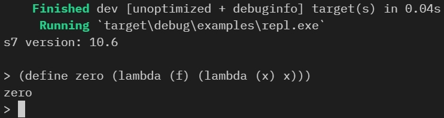

# s7-sys

[](https://crates.io/crates/s7-sys)

s7 Scheme bindings for Rust

About s7:
[https://ccrma.stanford.edu/software/snd/snd/s7.html](https://ccrma.stanford.edu/software/snd/snd/s7.html).

## Prerequisites:
- `Clang` toolchain is required to generate the bindings

## Examples:
- REPL [examples/repl.rs](examples/repl.rs):

  ```
  cargo run --example repl
  ```
  screenshot on Windows:
  
  
